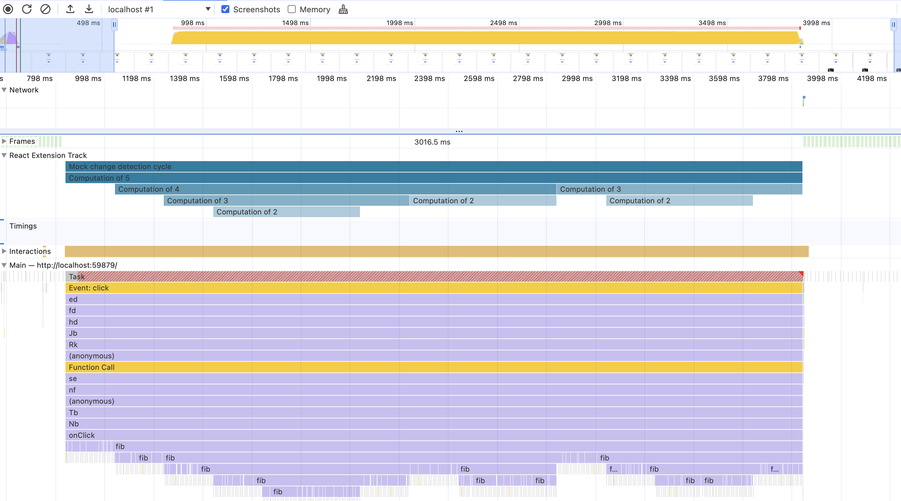

# React Corgi Collage

This is a basic React app that prototypes the ability to extend the
Chrome DevTools Performance Panel. The prototype is based on a proposal
to use a predefined format to pass structured data to DevTools using the
[UserTimings API](https://developer.mozilla.org/en-US/docs/Web/API/Performance_API/User_timing)
In this example, the format is used to adding custom tracks to the
timeline that supports all the features of the native tracks (f.e.
entries in a track can be clicked to reveal a detailed view).

## Extension data

In this example, the code triggers arbitrary tasks that are run on
rendering. This arbitrary tasks mimic tasks that are relevant to the
framework but that aren't shown by default in the Performance Panel.
The tasks are measured and registered to the browser using the
UserTimings API using the proposed predefined format to pass structured
data that includes the name and description the measurements will be
displayed with in the Performance Panel timeline.

The tasks are run and measured in the [main component](./src/App.js) in
the `mockChangeDetection` function.

*_Note: to trigger the measured tasks you need to add a corgi to the collage
using the "Add new Corgi" button._*

## Try it

A deployed version of the application is available at https://corgi-collage-react.vercel.app/.
You need to run a Chrome version that contains the changes to
DevTools that proposed User Timing API format.

## Example

